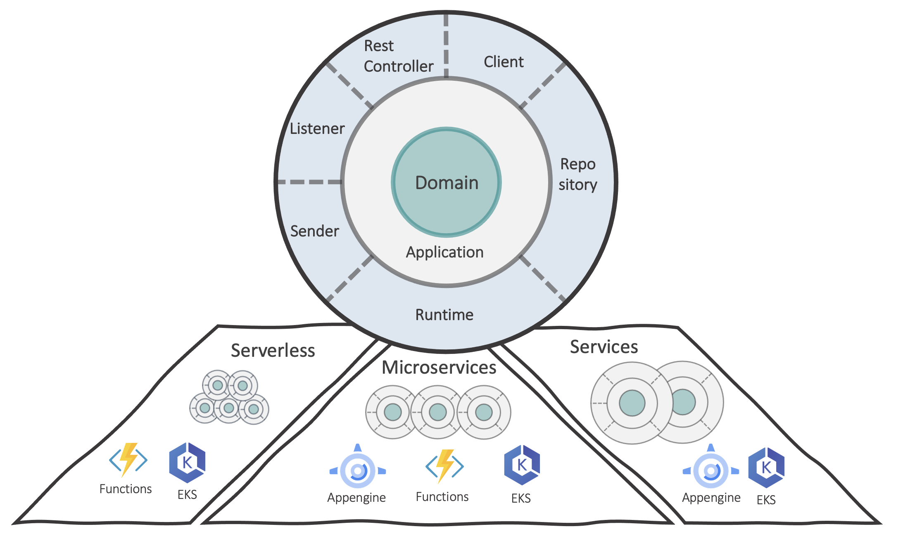

# PART1: Infrastructure Architecture
{: .no_toc}
* TOC
{:toc}    
## How we run what we built

The cloud offers an almost unlimited pool of **compute power**, **storage** and **network components** as a service

The main characteristics could be described as follows:

- **On-demand self-service**: Cloud resources can be provisioned without any human interaction from the service provider.

- **Broad network access**: Cloud resources are accessible over the network supporting heterogeneous client platforms

- **Multi-tenancy and resource pooling**: Resource pooling means that multiple customers are serviced from the same physical resources

- **Rapid elasticity and scalability**: Resources are provisioned and released on-demand and/or automated based on triggers or parameters. This make sure that your application have exactly the capacity it needs at any point of time.

- **Measured service**:  Resource usage are monitored, measured, and billed transparently based on utilization.

### So what is infrastructure architecture?

Its a blueprint on which cloud services the overall application is mapped and which contrasting infrastructure services are used to connect individual application parts.

The Idea of Cloud Native Applications is to make the best use of all the cloud characteristics as possible!

Because of this, the CN applications are often more distributed than applications on-premise infrastructure, so its very important to include infrastructure considerations in all your decisions.

The Part of the guide should help you to choose the right cloud services based on your application needs.

## Public Cloud vs Private Cloud vs Hybrid Cloud Provider

**Public Cloud** means services that are offered over the public Internet and are available to all users who wish to purchase them. Cloud resources such as servers and storage are owned and operated by an external cloud service provider.

**Private Coud** computing resources are used exclusively by users from a company or organization. A private cloud can physically reside in your company's local data center. Alternatively, it can be hosted by a third party.

**Hybrid Cloud** computing environment includes a public and a private cloud so that data and applications can be shared.

## IaaS vs PaaS vs SaaS (what it is)

**Infrastructure as a Service (IaaS)**: This model provides basic IT resources such as computing power, storage or network capacities. The user has control over the operating systems and applications; he usually has to assemble the infrastructure himself from the required computing instances and memories.

IaaS is usually not the right choice for cloud native solutions and should only be used for legacy parts of the applications.

**Platform as a Service (PaaS):** PaaS is a type of service that provides a programming model and developer tools to build and run cloud-based applications. A PaaS provider should automatically provide all necessary resources such as computing power, storage, network, middleware for message queuing or load balancing and databases when the application is deployed and scale them depending on the requirements. Integrated monitoring functions are also expected, with which the runtime behavior of the applications can be monitored.

PaaS services should be the first choice for cloud native applications

**Software as a Service (SaaS):** SaaS represents the top layer of cloud models. The provider provides its own applications for the users. This is where SaaS differs from its predecessor ASP (Application Service Provider), in which the service provider offered applications from other manufacturers for rent. Most of these were not multi-tenant, while SaaS support multitenancy by default.

The customer of a SaaS provider does not have to worry about the technical infrastructure or the installation and updates of the application. This is done centrally by the provider so that the current version of the software is always available to users.

SaaS should be used for applications which are not part of your core domain. Usually it make no sense to rebuild thinks which exists as saas with no need of customization.

## How to choose the correct cloud ressources for your application?

### considering constraints and organizational boundaries

Before your start with choosing cloud services, should considering the following topics

#### Greenfield vs. Brownfield

Greenfield or Brownfield should definitely have an impact on the choice of cloud services. If you already have a aged system, the first thing you should ask yourself is how to proceed with it.

It usually does not make sense to start with the services that are best suited for a task, but the resulting diversity together with the legacy services increases complexity, makes configurability more opaque and has a negative impact on your development at all.

Instead, it could make sense to start on a new, closed modules or subsystems with a different set of cloud services. There should be a clearly visible contract between the legacy and new services in the overall system. Measured against the remaining term and relevance of the legacy services, it should be assessed whether it is worth migrating them to other cloud services or not.

#### Costs

A big advantage of using cloud providers is, that it is possible to base the costs on the actual needs instead of an upfront invest like withhin an on-premise data center.

In order to make effective use of it, the costs should always be in focus when developing cloud native applications.

For every service that you plan to use, you should deal with the respective cost model. Services are often available in different tiers depending on the required feature set or usage within a certain period of time. Free tiers are also not uncommon if the requirements are low.

The following things should be taken into account when considering costs:

* Which tier fits the requirements of my application

* Does the service fit into the project budget

* A characteristic of cloud native applications is not always to watch for the service with the appropriate cost model. Instead you should align your application with the cost models

* In non-productive environments, cheaper tiers can be selected or the overall sytem can be shutd owncompletely while they are not in use

* Some services are cheaper if they are reserved for a longer period

* The selected target region can also influence costs

* Each cloud provider provides cost calculators to calculate how much a service costs depending on the entered usage.

* You should make regular use of the cloud cost-monitoring solutions. Cost models are adjusted occasionally. Changes in the workload can also have an unforeseen effect on costs

#### Longevity

Another important question, "how long should your application exist, or how long are people available who can actively design the system".

The higher the abstraction layer of a service is, the less you have to invest in development or operation and you get results very quickly. Cloud native applications use this advantage by combining a large number of different services to have low initial costs in the respective solution space.

What you need to know, cloud services change over time. Especially with services on a high abstraction level , it happens sometimes that these services are completely redesigned with changes to the cost model. So maybe, it make no sense to use it anymore for the application or even harder the service could be completely removed by the provider.

That is why it is important to be aware of this, right from the start and you should design your cloud infrastructure in such a way that services can be exchanged with a reasonable amount of effort and, above all, that people and budget are available to make these adjustments. If this cannot be guaranteed, it can make sense to choose services on a lower abstraction level, where the initial effort is higher but the runtime is more constant.

#### Service Level Agreements

Every cloud provider guarantees certain "service level agreements" for different services. These are regulations for general availability, speed, reaction time in case of errors, the recovery time after an error or how much time must elapse between downtimes. If these agreements cannot be kept, which cannot be prevented, there is a certain contractual compensation depending on the provider.

In common, everybody speaking about the percentage availability over time in context with SLA's. This often corresponds to an value between 99.9% - 99.999% (called 5 nines). If a service only has an availability of 99.9% then it can be down about 10 minutes a week, from a contractual point of view. A 5-nine service is only 6 seconds per week not available.

However, it is not enough to just evaluate individual services. If you want to achieve your total availability, you multiply all values from each service together, e.g. 99.9% x 99.9%. This leads to an value of 99.8%. If you need a higher availability for your customers you should:

* switch to other services

* choose a more expensive or higher tier

* Use cross-regional features

* Increase availability by absorbing possible service failures through compensation mechanisms. For example, cache data if it cannot be delivered and try again later. This often increases the overall complexity and you need more components to fulfill it, which in turn, have a negative effect on the availability. Because the new components can potentially fail too.

Once you have calculated the availability on the cloud side, it is often not enough to pass this directly to your customers. You should also allow your team an "error budget" for your application. You add a certain amount of time that is either consumed by unplanned application failures or by planned maintenance windows.

It is important to plan SLA monitoring from the start and to display it on company dashboards. If an application is very extensive, it often makes sense to not only write an overall SLA but also for certain sub-areas. This often has a positive effect on the availability calculation.

#### Roles, Responsibility & Collaboration

In addition to the technical influences, human conditions and team structures should be also taken into account when planning the cloud infrastructure.

You should ask yourself what kind of team-knowledge is available in order to have a good mix of existing experience and space to try out new technologies.

The structures outside of the development team also have an impact on what you build. Note the following:

* Are there system parts that other teams provide and should be used? If so, what are the interfaces and how do you get the communication as narrow as necessary.

* Are there system parts that other teams provide which are should not be used,  so instead you should rebuild the functionality by your team, mabe because of different development speeds between both teams or the expected amount of changes over time.

* Are there general selection or configuration conditions for services based on cross-sectional platform requirements or something similar?

More considerations on this can be found in this blog (in german): https://www.maibornwolff.de/blog/plattformen-als-motor-cross-funktionaler-teams

## Start using the right Services

This part of the guide leads through the most frequently used areas in which decisions have to be made, depending on the mentioned constraints.

### Choose your Runtime

One of the most central decision that has to make for an application is the selection of the right runtime environment. It is not uncommon to need more than one environment.

#### Dependencies to an operating system

If your application has an dependency to any kind of operating system, then maybe only IaaS services such as virtual machines are relevant for you. With common cloud providers it is very easy to create executable VMs in minutes. Nevertheless, you should only choose this variant if you cannot choose a PaaS service, because it is a brownfield application with legacy services. For new applications, you should choose a technology framework thats not dependent on a VM, for the following reasons:

* You need people in the team who are capable of hardening the machines. It is an ongoing process and takes time.

* If the application should scale horizontally, cloud providers offer options such as "auto scaling groups" within AWS or "vm scale sets" within azure, but you should be aware that scaling exclusively via VMs is rather cumbersome and if every application service should have its own VM group, it is also very expensive.

* Automated deployment on VMs are usually more complex because they are based on a low level implementation. At the same time, pipelines or structures such as "golden images" etc. have to be considered for operating system updates.

Sometimes you can't get around VM's completely, but you should prefer other runtimes for cloud native applications.

#### Focus on PaaS services

If you look at PaaS, the selection from cloud providers is quite large.

Basically, when choosing a suitable PaaS runtime, you should exclude from above. High abstraction levels usually deliver faster results, reduce the administrative effort and often provide cost models that are more geared towards usage behavior and not just over time.

##### Serverless with Lambdas or Functions

This kind of solutions are particularly suitable for event-based architectures. There are a variety of possible triggers, such as reactions to new queue entries, changes to databases, changes to storages or time-controlled events. In turn, they are often themselves triggers of an event in which the result is stored somewhere or passed on.

The advantage of serverless runtime is certainly a high focus on business code and not technical code like how to connecting to external sources or other stuff. Except of a little configuration, this happens out of the box. The code also runs within an enclosing runtime host environment, which takes independently care of e.g. reacting to a certain port or the instrumentation of tracing etc.

Function based architectures are inherently fragmented. As the application size increases, the challenge is, to ensure non-functional requirements such as maintainability, performance, etc. Even with, or especially with, such small-scale systems, you should have clear rules for e.g. data flows and should constantly control them through real-time visualizations. Cloud providers often offer native solutions for this.

HTTP calls are also handled as events and are triggers for function execution. If you do not want to cut the technical services so fine grained on function level, with Azure Functions, for example, you can merge several functions, maybe each for a different HTTP route, in one code project. This  wraps up a common domain core and serve different routes together, similar to an API service. All functions are hosted in one instance and scaled in one unit on runtime level for this specific API service. However, the function runtime is still event-based and initializes certain things by default only with the first call. And in addition, depending of the cost model, the first call will be a cold start and need more startup time.  If this is not desired or if more control over the runtime host is required, then classic PaaS application services may fit better.

##### Application services

Application services such as "azure app services", "aws beanstalk" or "google app engine" are used to easily host applications in different languages. This is usually based on fully managed virtual machines that automatically scale as required and, unlike IaaS services, do not require any maintenance. The cost models also offer options for "shared infrastructure". A service does not directly use its own VM, but rather the need for compute and memory, independent of individual machines.

In many cases, application services offer the best match when it comes to a few business services that are more coarse than fine-grained. 

The deployment options are very simple. With Azure, for example, there is natively the option to simply switch between environmental slots (blue / green), but always focused on individual services. If you want to manage related versions across all services, you often have to build a solution yourself. The need for this increases the fine-grained an application becomes and this often applies to serverless function solutions from above too. Of course, it is possible to choose a deployment and release strategy where each function or app service can be viewed as an independent application and deployed accordingly. However, as the number increases, this is very demanding. The team and organizational framework conditions do not always match.

##### Container solutions

Container solutions, for a number of reasons, have been established tools in software development for years. Containers enable the advantages of immutables in a lightweight manner at the application level. Once an image has been built, it can be tested locally, without any changes, passed through test environments with the help of a pipeline and ultimately deployed in the production environment.

However, containers require a runtime environment from cloud providers.

Depending of the Cloud provider, it is possible to use application services together with container images. So some advantages that come from individual container images can be combined with the simplicity of the application services.

**"Dockerhost as a Service"**

When the application gets more fragmented, cloud providers offer simple hosting solutions for containers, such as "Container Instances" on Azure. With this service, many images can be deployed directly into a single cloud service instance without having to instantiate a new application service for each container image. But keep in mind that you have to manage scaling behaviors manually. Basically, it is something like an "Dockerhost as a Service". Of course, you could also provide a Docker host as a VM yourself, but that falls under IaaS with all its disadvantages and should not be the first choice.

**container orchestration**

The smaller an application becomes, the more advantages containers bring with them. You can easily test and deploy whole groups of images with the same versions in context. For this kind of applications, consider a container orchestration like a managed Kubernetes. Together with package managers such as helm, entire version matrices of many container images can be managed in the repository and idempotent rolled out again and again to individual environments.

Cloud providers offer different solutions for container orchestration platforms. In recent years, a managed Kubernetes variant has largely gained acceptance. However, there are differences in the degree of abstraction. At GKE, Kubernetes can already be understood as PaaS, where you havn't operate the cluster at all. The abstraction of the service is very high. With Azure's AKS Service, the creation of a cluster is still at PaaS level, but after that you already have operational expenses such as regular updates. If you decide to use a kubernetes in this situation, you should consider whether the team not only should have development know-how, but also later the operational know-how.

A container orchestration is also a good choice if you are planning to use open source solutions for cross-cutting issues such as monitoring, logging, tracing etc. (see also Cloud Provider Solutions vs. Open source)

Function architectures also benefit from containers. With a large number of functions, these can be operated directly with a container orchestration using specific frameworks such as KNative or KEDA.

All of the hosting solutions mentioned are aimed at more classic applications. In addition, cloud providers offer a variety of different services for machine learning or something.

### Choose the right supporting Environment

Related to cross-cutting solutions such as monitoring, alerting, tracing or logging, the range of suitable open source solutions is huge. Toolsets like Prometheus, Thanos, Grafana, Alertmanager, Elastik Stack, Tick Stack or similar are used in many projects. Normally, the range of features is often more extensive than with cloud provider native solutions.

Nevertheless, it should be carefully considered whether the full range of features is really required and provides real added value. Cloud provider solutions are usually much faster to use, as no operation is necessary and can be used immediately for the selected PaaS services without external integration.

Open source solutions should be used wisely. Open source tools should only be used if the provider's own solutions are insufficient and the additional operating expenses can be guaranteed.

### Choose your Data storage

There are a number of ways to save data. It is not uncommon to use different data services within one cloud application. For some purposes a simple blob storage or a simple time series database is sufficient, for others a full featured database service is needed.

**"one database to fit them all, isn't a good idea for most cases"**

Even if it seems easy to choose a single data service and use this service for all types of data, it usually makes sense to select the appropriate data layer for each data-type within a cloud native application. 

Compared to on-premise or an IaaS operating data service, the effort in terms of operational issues differs significantly. The use of PaaS - services, simply creates the possibility of choosing exactly the data service that is appropriate for the requirements. This has been difficult to achieve in legacy environments, because with every new technology not only the operating expenses, but also the required operational know-how increase significantly.

Nevertheless, 2 things should be in focus: 

**"Simple as needed and choose the most available serverless database instead of a low level service"**

The following questions should be considered when choosing a data service in relation to the data-type.

**data structure**

Which data structure fits for the application? Cloud providers offer many different types of data storage as a managed service. Whether a blob storage, a (no) sql database, a graph or time series database is more suitable, depends on the corresponding application architecture and is out of scope here.

**data usage**

If it is clear which form of data structure is required, this restricts the selection of the corresponding services, but there is still a range of different serviceoffers for a required structure. 

Therefore, further considerations are necessary. Think about how often your data is accessed. Differentiate between reading and writing. For example, if the application is written very rarely but read a lot, a simple cache service could be more useful than a permanent persistence layer. In cases where data is only stored for the purpose of a history and is not readed from the application, a simple blob storage could be more suitable than a classic database service. Cloud providers usually offer archiving or cold storage features for such use cases. The data can then only be read on request within long waiting times, but the storage costs are very low for a big amount of data.

**billing model**

The billing model is an important factor when choosing a database. Some services offer a quota of storage and queries over time at a certain price. Such services considered as a PaaS model, because they are managed by the cloud provider, but the billing model is more based on IaaS. The advantage is certainly the ability to plan, since the costs remain roughly constant. If the application workload is just as constant and plannable, the billing model may be appropriate.

In contrast, there is a pay-per-usage model. Each operation is billed individually. Usually, operations are not only data operations, but also maybe index scans or creations/changes of storage containers itself. Badly organized data or indices make every operation significantly more expensive. 

Such a model definitely requires more attention and good cost-monitoring, but in contrast to the time-based model, it offers more potential in terms of cost control, especially when the workload is very volatile. 
In this model, the "servers" no longer play a role and that is why it is often called "serverless". For example, in the time-based model, if 2 instances should running on different parts of the world,  this can quickly double up the costs, regardless of how many queries are actually sent to the database. In the usage model, replication features may make individual queries more expensive, but it does no matter how many "servers" are distributed around the world, only the number of operations are paid, regardless of where they are currently taking place.

No matter which kind of billing model a service offers, the amount of the costs mainly depends on feature scopes, additional to the data handling tself. For example, a StorageAccount - TableStorage in Azure, can be sufficient compared to a full featured CosmosDB. Both can even be addressed via the same client library.

**Georeplication**

Regarding to georedunant availability, data layers differs from the application layers. Given that application services are stateless, they can easily be deployed worldwide in different regions and the corresponding traffic can be routed to the service that is closest to the user. A little more attention must be paid to data.

First, it have to be checked which options the corresponding cloud data service supports. Depending on the requirements, a common use case is, when data is written to one region of the world, it is replicated to other regions and vice versa. It must be taken into account which isolation level is offered. Depending on that, there can exists strong latencies if data should be replicated, before the change is released for reading. 

Sometimes it makes more sense, to write only in one region from all over the world and replicate  data for reading to other regions, especially when less data is written but much more read. 

Another common use case in a multitenancy environment is, that certain customers wants, that their data may be stored in a certain region, and this differs from customer to customer. Before deciding on a service, you should consider the possibilities of a corresponding cloud data service.

**Encryption**

A common requirement is the encryption of data. In the context exists more than one level. The following questions should be asked about encryption.

* Is it necessary to encrypt the storage for the data?

* Is it okay if the cloud provider has the ability to decrypt it, or should the cloud service be able to store my own encryption key in some form without provider access? This is often an important compliance issue and a requirement of many customers. Often it is just not enough to save the data in a region of a certain country, if the cloud provider itself is, for example, an american company.

* Does the cloud service have to offer end-to-end encryption including incoming transfers via the APIs?

* Encryption per customer is an increasingly popular feature. Is it required that individual customerdata in a multitenancy environment be encrypted independently?

**Recovery**

Often anybody speaks of backups, but the important factor is recovery, not backup. Check what options the cloud service offers to restore data. 

Point in time solutions are common. You configure how often a snapshot of the data is created and over what period of time. In the best case scenario, the cloud service offers a self-service for a recovery on a specific point of time. This has the advantage that you can react as quickly as possible. If self-service is not supported, the default is usually a support ticket to the cloud provider, which then, depending on the criticality, restores the data within a certain period of time. Even if this is the only way , it should still be avoided to build a backup / recovery solution around the service. At least the question should be asked whether your own solution can achieve the same reliability or SLA as the cloud provider's own mechanism.

Regardless if it is via self-service or a support ticket, it should be checked regularly whether the recovery works as expected in practice.

You should experience what happens after recovery.

* Has the current data been overwritten or will it be created again under a different service name?

* Does a switch to the new service work in a live environment?

* Is the switch sufficiently automated?

* Are the data usable after the restore, or does a reindexing have to be triggered?

* If geo-replication is used, does data access work smoothly from anywhere?

* Have all non-data-related configurations been restored, such as firewall/network rules or user-accessprofiles?

The speed, at which a recovery can be carried out and thus data is available again for the user, is an important factor in terms of data integrity (see [Google - Site Reliability Engineering at Chapter 26](https://sre.google/sre-book/data-integrity/))

**self managed data service**

Sometimes you want a specific database type or product, which is not available as a managed cloudservice in a specific cloud provider. In most cases it is not a good idea to run the database inside your Kubernetes cluster or on any IaaS Cloud Levels. Be aware of the complexity and work which goes with this decision. 

Sometimes it makes more sense to rethink the application architecture and optimise it for a suitable service which is available on a managed way.

### Choose your Communication services

Cloud native applications are usually fragmented and application components share information with each another. 

There are various communication options. 

Depending on the requirements, these communications are either synchronously or asynchronously. The decision which components talk in which way to each other is not part of this chapter, but belongs to the application architecture part.

For both types of communication, cloud providers offer a variety of services. Similar to the data layer, it makes sense to rely not only on one service type, but rather to choose the right service per communication path, with just enough features for that purpose.

#### Asynchronous Communication

Related to the term "asynchronous", message-based communication is often meant. And as already mentioned, cloud providers have many different ways to exchange messages between two endpoints.

Depending on your application, you can choose between a message service designed for throughput or consistency.

**Throughput** 

Throughput is primarily intended for streaming-based use cases. 

The latest information is more important than a single message. Instead of attempting a retry or block the message stream in case of an processing error, the live stream should not be aborted. 

These types of services are able to process more than a million data per second. This is mostly possible because the data is only saved once and not duplicated for each consumer. Every consumer manages something lika a data-bookmark to control the message flow.

These services are most suitable for applications that process telemetry data or can be used with analytic services, which are able to combine, transform and forward various messages in real time.

There is a difference if is it only about data processing or also about managing the associated devices. In this case you should take a closer look at the IOT services of cloud providers. These are also able to send messages back to devices, change settings on it, and even with the help of edge computing are able to outsource certain cloud features directly to devices on site in order to aggregate data without latencies before it is transfered to the cloud.

**Consistency**

Queue-based messaging services are usually more about transaction security. The individual message is more important for the consumer application than the real-time situation. Messages that have been removed from the queue are usually gone immediately.

if your application uses queues, you can decide between different kind of queue services. A simple storage-based queue is often sufficient, especially for single relationship between 2 applications.

If there exists more than one consumer for the same data, you should better choose a managed queue service that is able to create multiple queue instances for different consumers, which match the publish and subscribe pattern. In addition, there are often more control options such as automatic retries of incorrectly processed messages, or dead letter queues to save messages which processing was still unsuccessful after several attempts. Since the messages physically exist several times, they accordingly require more storage space.

**Further considerations**

Messages are basically about data. Therefore, It is not surprising that the same questions apply as for the data services (see How to choose your data service)

* **Encryption** - Before data is stored in a database, parts of it exists on a message channel for a while and you have to care about encryption. See whether the corresponding service supports your requirements here. Is it possible, for example,   to store your own encryption key or something?

* **Geo Replication** - What options does the corresponding service offer to ensure availability in case of an error? Can the message streams be replicated, to ensure smooth operation even if a data center fails? Is georedundancy supported? What about the message producers in this case? You should test this Scenario.

* **Billing model** - does the billing model fit the functionality of my application? Are you billed according to the throughput of messages or service livetime? Were all the features of the full managed service really required?

* **Retension** - how long is it possible to keep messages after they are retrieved by the consumers?

#### Synchronous Communication

Classically, it is often about some kind of communication via HTTP. Although this usually happens directly between applications without a used cloud service,  but there are still many services that can control synchronous communication between applications or between the cloud backend and the client, like an browser.

If you need a proxy in your application, you can choose between different variants of gateways. 

For example a simple IaaS LoadBalancer, that operates on a TCP base, or, if it is necessary to access the content of the data, a Level 7 LoadBalancer are offered as a service by every cloud provider. 

There can be also different variants of it. With Azure, for example, there is a distinction between an Application Gateway and an Azure Frontdoor Service. Essentially, the main difference is, that the application gateway is only regionally available where the frontdoor service operates globally. In other words, if an application is used in multiple regions, a single application gateway is not sufficient.

If the requirements go beyond the routing of data, you should consider a API management. 

An API management service not only offers different policies for incoming and outgoing data, but can also be a company-wide uniform contract which various applications located behind. 

With global policies, you have options like defining rules that apply to all subordinate APIs or you can integrate other HTTP requests into an incoming request from the outside. Of course, you can even use policies for authentication support. Depending on the provider, API services are compatible with the open api specification and you can use it for API documentation with try outs.

Such an API management service is often very extensive and costly. Therefore, different development teams should find ways and processes to deploy together in one instance.

**Further considerations**

No matter which service you have to use, you should be careful witch form of synchronous communication are possible.

- Does the service support gRPC if necessary?

- Can I setup a websocket communication between client and backend if needed?

- Is it possible to restrict public accessibility?

- Are the service able talk securely to components in a closed network?

### Plan your network and accessibility

The complexity of an cloud network infrastructure mainly depends on whether the application is a pure self contained cloud native app or need a direct connection to on-premise installations or other cloud apps. 

Especially with the on-premise connection, this should not be underestimated and you require a lot of network competence in your team. Nevertheless, cloud providers offer some support services that enable a direct on-premise connection that are out of scope in this guide.

**Restricting accessibility**

Naturally, a cloud native app can be built without network services. 

However, bear in mind that this kind of app often consists of many small components and different services. This creates many attackpoints and all have to be considered. PaaS services usually offer sufficient protection here, but you still have to deal with everyone and evaluate them for your own scenario.

It is a good idea to think about carefully which components of the application must be accessible from the outside and which only communicate internally with each other.

A standard procedure is to create a virtual network. The cloud providers offer variants for this on PaaS Level, which requires only basic network knowledge. 

Normally it makes sense to create a logical subnet separation according to the application layers or your technical components. Note that some services, for example a Kubernetes service, have their own subnet as a prerequisite. Then, assign all components to the virtual network or subnet, which should not be accessible from the outside.

A virtual network shouldn't be the only wall, but it is first of all a good starting point. 

The next step is to determine where the desired external access point should be, or which cloud service you want to use for it. The gateways mentioned above, such as API management systems, tcp based or level 7 HTTP load balancers are in general suitable here. These instances are also assigned to the virtual network, but at the same time they have a public accessible endpoint. 

On a PaaS level, there are a number of useful services for securing applications, such as firewall services, DoS protection services or other AI-based layers. Classically, things like authentication, SSL termination or other security-relevant configurations can often be placed at this point. 

Even if you only use PaaS services, your team should definitely not handle this kind of topics without a security engineer. Often, cloud providers also offer auto generated instructions for improving security that should be taken into account.

**Further considerations**

- Is it possible to add a specific service, that I want to use, to a virtual network at all, or do I need a different billing model?

- If certain services are not able to run in a network, what other options are available for protection? Can I restrict access via blacklisting or whitelisting or other forms of authentication?

- Are all required features available when the service is running in a closed network?

- If all my services cannot be reached from the outside, can the pipeline agents still deploy?

**Connections between multiple cloud apps**

If there are several cloud applications that should talk to each other, a "hub and spoke" pattern is a common variant. 

So each self-contained application should has its own network. Additonally, there is a central network called "hub". All application networks connect to the central hub. For this purpose, cloud providers offer a type of peering, which must be initiated from both sides. After all, this creates a star pattern and all application networks can communicate with each other without being directly connected. Central communication rules can be placed into the hub network, which is another advantage.

Incidentally, an on-premise connection would be just another branch in this star.

## Documentation and diagrams

Some short hints for your documentation workoad.

* Use Provider icons sets. Common cloud providers share for nearly all services suitable icons, which you can use on your diagrams. It helps to identify services fast, instead of reading a small text inside a colored square.

* use diagrams for communication not for documentation. For documentation purposes try to use native cloud provider tools. A lot of visualisations can be automated. If you build infrastructure on cloud, most informations are moving parts and changing over time, like IP addresses or specific machine instances etc. It doesnt make sense to change your diagrams and pictures all the time

* Think about your audience if you drawing diagrams. Don't try to add all informations on the same picture. especially when your communicate different layers of details. if you want to give audience an highlevel overview how your services cooperate together, it could be missleading if you communicate your network topology in detail at the same time

## Which automation tool should i use?

In the end, it is not a good idea to create cloud resources through providers specific web UIs. This is more helpful to get to know the service or the different configuration options. For the production usage, you should be able to create and maintain the infrastructure fully automated.

There are several aspects involved. Note, that there is not one infrastructure, but usually several environments that may differ. Think about a structure in order to be able to manage environment-specific and shared configuration.

Usually automation tools should be used whitin the pipeline for this purpose.

### Provider native solutions

A simple option is to use the provider specific templates for resources. In Azure, every cloud resource can be managed with the Azure Resource Manager. These are json-based template files which can be used to describe all desired cloud services and their properties. AWS calls these templates Cloud Formation.

**Advantages**

* Such a template can be created very quickly and offers a quick start. Often it is sufficient to create the resource via the UI with all required properties and then  generate a template from it. This can be parameterized and integrated into the pipeline.

* The cloud provider manages the state. Templates are declarative and there is no need to worry about whether the resource already exists or is being created. The desired target state is in the template and the cloud provider make sure to that the state will be reached.

* The native templates support any properties that the corresponding resource knows. Sometimes certain settings are not yet adjustable via the UI or a CLI.

**Disadvantages**

* Depending on the provider, the templates are not always easy to read, because they can sometimes be very long. However, there are even DSL's available to address this. Perhaps for Azure, one is called [Bicep](https://github.com/Azure/bicep) and increase readability.

* Although the templates can be parameterized, a structure for environments and the corresponding configuration must be built around it. In addition, resources are sometimes related to each other. Some values ​​are not available for resource B until resource A has been deployed. These values ​​cannot always be referenced in the template and a supporting tool such as a CLI is required to access these values ​​subsequently.

### Terraform

[Terraform](https://www.terraform.io/) is a powerful, provider-independent tool that was not only created for provisioning cloud resources. The concept behind this is a provider-independent configuration language.

**Advantages**

* The Configuration Language is very easy to read. Often it it is possible to describe a resource with a few lines.

* With Terraform as a wrapper, many services can be described in a provider-neutral manner. This makes it possible to deploy the same resource description and configuration on different cloud platforms. However, this only works as long as no provider-specific configuration is required. This is more related to IaaS services, since PaaS services are more specific on a configuration aspect.

* Terraform offers extensive support to get values , ​which are generated during the provisioning, in order to use them for further automation processes without scripting it with a CLI.

* Terraform is very suitable for a structured management of environment configurations. Different levels can be created or overwritten. Even reusable modules can be created.

**Disadvantages**

* Just like the Cloud Resource Manager, Terraform works declaratively, but it manages the state independently from the cloud and is therefore not directly hidden in the respective provider. This is not a real disadvantage, but you have to make sure that everyone has access to the state who wants to run Terraform. If you start Terraform without the current state, serious side effects can occur. However, Terraform offers possibilities to conveniently store this state in the cloud, perhabs on a storage or something. It is strongly recommended to only call Terraform from within a pipeline.

* Since Terraform is a kind of wrapper, there exists a layer between the possibilities of cloud ressources and what is manageable by terraform. This means that you are dependent on the actuality of a set of specific terraform providers. Even if there is a huge community behind it, it can always be the case that you have to find a workarround for specific features of a service.

### Chef, Ansible and Puppet

All of this three tools are configuration management systems that have been established for years. 

However, based on the history, the focus is more on managing application states. That means, there are powerful to manage systems that should run on IaaS cloud ressources, regardless of server or clients applications, but not the infrastructure provisioning itself.

Of course it is possible to do infrastructure provisioning with all these tools. But not with the same possibilities like Terraform. 

Nevertheless, it can make sense to rely on these tools if the entire landscape is designed for them and the configuration management should be used even for infrastructure. However, it is more limited to IaaS services. If you want to deploy PaaS services with it, a common way is, to use these tools to deploy cloud provider templates. This means, that the configuration and execution remain on a single platform or tool.

## Links

[Was ist Cloud Computing? - Learn  Microsoft Docs](https://docs.microsoft.com/de-de/learn/modules/intro-to-azure-fundamentals/what-is-cloud-computing)  
[https://medium.com/@pkerrison/pizza-as-a-service-2-0-5085cd4c365e](https://medium.com/@pkerrison/pizza-as-a-service-2-0-5085cd4c365e)  
[Plattformen als Motor cross-funktionaler Teams | MaibornWolff](https://www.maibornwolff.de/blog/plattformen-als-motor-cross-funktionaler-teams)  
[Google - Site Reliability Engineering at Chapter 26](https://sre.google/sre-book/data-integrity/)  
[Hub-Spoke-Netzwerktopologie in Azure - Azure Reference Architectures | Microsoft Docs](https://docs.microsoft.com/de-de/azure/architecture/reference-architectures/hybrid-networking/hub-spoke?tabs=cli)  
[GitHub - Azure/bicep: Bicep is a declarative language for describing and deploying Azure resources](https://github.com/Azure/bicep)  
[https://www.terraform.io/](https://www.terraform.io/)