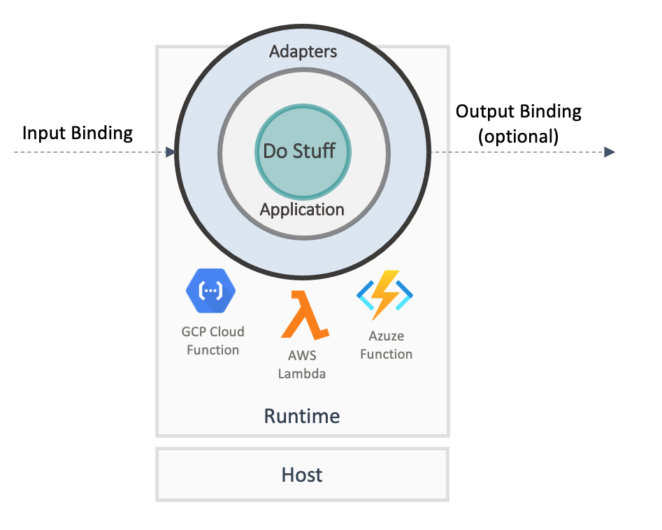
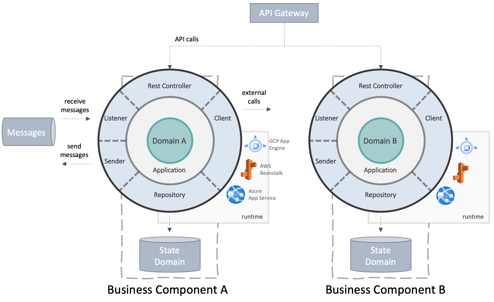
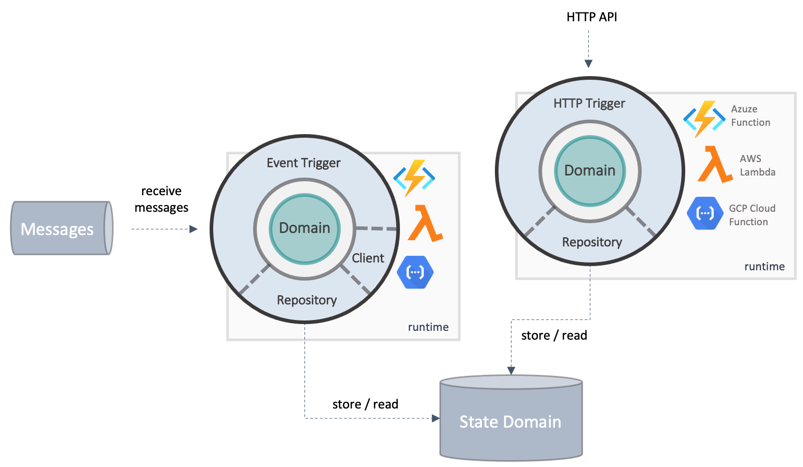
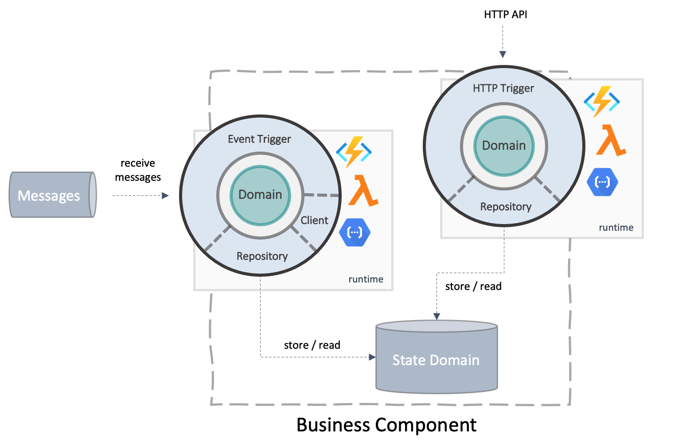
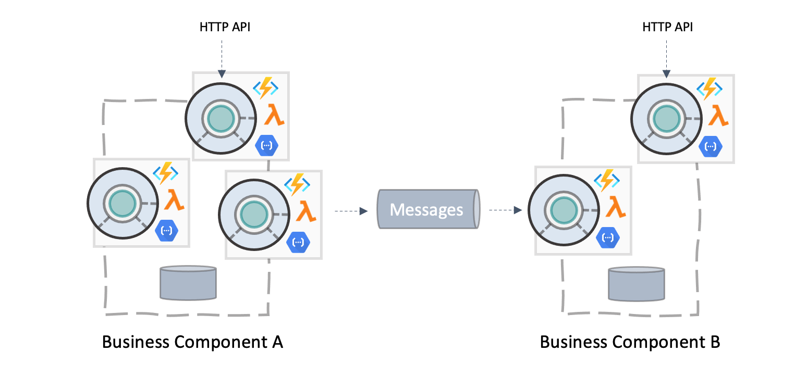
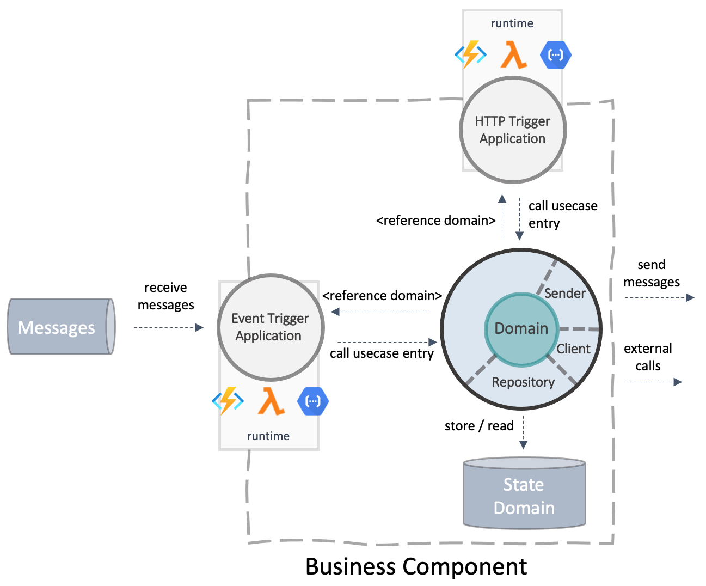
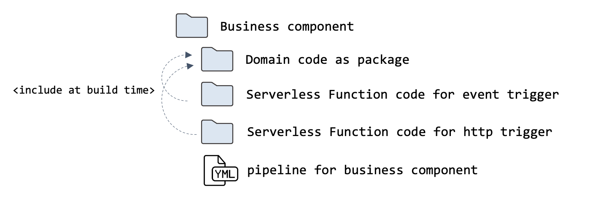
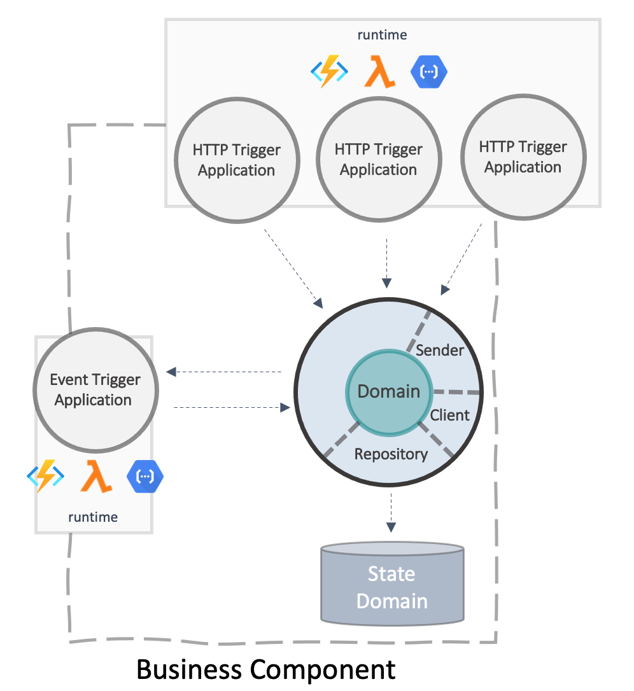

# Part 2 Build Applications on Serverless cloud services
{: .no_toc}
* TOC
{:toc}    
## "Serverless" What does it mean?
As it starts with serverless computing, it used to be associated with AWS lambdas or Azure Functions.

With serverless computing, everything focused on architectural ideas for building applications based on many small functions, especially in the beginning. Either on cloud provider native environments like Lambdas, frameworks like Knative, or the "serverless framework." (links)

That's right, but serverless is now more, and the use of the term has shifted a bit. As an example, AWS categorized the S3 storage under serverless. Azure names high-level operation tiers for many services as "serverless" since it is often an abstraction with minimum contact with operations.

Serverless means keeping the operating costs for cloud-native apps to a minimum without the need to manage individual hosts, VMs, or nodes. The development focuses on content and not operation. 
A consumption-based database service where it is invisible how many distributed host instances run the service is just as serverless as a Kubernetes cluster used as a control plane, where individual nodes no longer play a role.
Consumption-based in this context means you are billed just for actual on-demand usage instead of operating hours.

Cloud-native applications make as much use as possible of serverless-based cloud services to focus on developing technical use cases instead of spending a lot of time configuring the suitable scaling for the operation of infrastructure. In modern application development, an application usually starts with a PoC, becoming an MVP. Later, with growing demands and users, the workload in the system increases. With consumption-based billing, the costs will scale with the size of the application. Serverless charges start very low on small workloads. Often, the first million calls are free. An upfront investment in computing or storage is not necessary. 
The difference becomes even more tangible when the sys

## What are serverless functions?
Serverless meets functions - a perfect match.

Serverless functions are cloud services that enable developers to write and deploy code like a classic function of any high-level language without implementing host-relevant tasks, such as controlling an application lifecycle or listings on ports.

Since functions no longer concern themselves with the lifecycle management of a specific host, they are event-driven by design. There needs to be a trigger to execute the computing function. The event that triggers the call can be, for example, a message on a message bus, a call to an HTTP endpoint, a new data record in storage, or a time-controlled event. For many different trigger types, it's a one-liner to bind a function to an event.

From a computer science perspective, a function natively consists of input -> processing -> output. It is possible to bind the "input" to a business event and to connect the result directly to a suitable output resource, such as a database table or a message queue.

Functions are a perfect match to serverless since there is no effort in code to control a host, and because of the simple input and output bindings, there is nearly no cross-cutting code. This fact reduces the development effort almost exclusively to the business domain code.

Of course, the code runs "somewhere." As seen in the picture, the called code runs on a runtime, which takes care of the lifecycle and often includes functionality for logging, tracing or authentication, or transport encryption.

There are various ways to host such kind of runtimes. Regarding serverless, select an environment that reduces hosting costs and has the right tradeoff between features and operability.

## Hosting Modelle für Serverless Functions

Beispiele für betriebsmodelle Für die Runtime.

- einzelne Functions nur dafür geigenet kleine Tasks zu erfüllen
- Knative
- KEDA
- Serverless framework
- Google cloudrun
- ...

## How to design software with Serverless Functions

### Technical domain in classic microservices
In software design, orienting yourself on business domain aspects is a good approach. Within a monolith, the structure of the domain influence the business component design, In the case of microservices, the service separation. The aim for services and components is to structure the domain so that they can act technically independently, known as "High cohesion and low coupling."
The following image shows a classic microservice approach. Each service is responsible for a specific, definable part of the domain and is as independent as possible from other services. Each service has a separate data layer and offers different communication interfaces depending on your needs, such as REST API endpoints or sending and receiving asynchronous messages.
The example shows a hexagonal architecture approach that puts the domain at the center of microservices development. The application layer, which does not contain any logic but contains the entry point for the domain, is placed directly around. The outer layer represents the adapter layer, which connects the domain to specific external resources such as databases, message brokers, or other microservices via clients. Provided APIs are also part of the adapter layer. (Links to various Maibornwolff blogs about DDD - Silas, e.g.)

Patterns such as Domain Driven Design can be optimally applied when you align the service design and separation with the business cases. In a good service design, developers should change as few microservices as possible for business adjustments.
From a technical point of view, however, these design patterns could be suboptimal since the scaling happens simultaneously for several input-and output channels. The runtime environment cannot choose the minimal or maximal requirement number of instances per microservice channel since each scaling configuration affects the entire service.

### Use a more fine-grained approach
A classic mapping of a microservice to serverless functions often looks like the following figure. Each input resource has its serverless function and, thus, its application and runtime project. In the example below, a Serverless Function listens for incoming queue messages, and another Serverless Function uses a trigger for a specific HTTP method.

Divide the message handler from the HTTP API solves the problem of technical-driven scaling. Depending on the respective input trigger, the host environment could optimize scaling for each serverless function.

However, it is now a technical-driven separation and no longer a business domain decision. There are now two domain cores. Assume that both functions solve the same business use case like the classical microservice above; Now, the domain is split into two cores. As a result, dependencies between the two functions automatically arise. Using the same database and very similar data models leads to significantly more code duplication than before. It is possible to extract data models via separate shared libs with versioning. But this is an antipattern for microservices for a reason. It creates complexity and dependencies again.

### Virtual Components
Patterns that have become established with microservices, as each service may only have access to its database, cannot be enforced when using serverless functions, which makes sense from a purely technical point of view.

Is a single serverless function a self-contained technical context such as a technical domain section? No - a serverless function usually only fulfills a small technical aspect of a larger domain-driven service. But that means the sum of all technical event triggers, which are classically combined as a microservice, forms a domain. But Just virtual, which is an important finding. 
Imagine a large application consisting of many Serverless Functions with different domains. And each function accesses any resources and data layers just because you design functions from a technical perspective. In that case, an unmaintainable overall application arises over time.

Even with applications based on Serverless Functions, it is possible to design your application according to business components. 
Here come virtual components into play. Form these virtual components around business domains, as shown in the following figure.

If the domain boundary is clear, you can define rules and contracts for communication between different virtual components. For example, it can be specified that functions should only be allowed to interact within a component with a data layer and for component to component only asynchronously via a message bus. In other words, many patterns established in microservice design can be reused, except that the technical processing of individual aspects has been divided between different runtimes (see figure below).

### Extract a domain core for every virtual component
Even if the separation into virtual business components is an excellent first step, the problem of the distributed domain core remains.
Implementing a hexagonal pattern in every serverless function in small parts is possible. But a Serverless Function is often nothing more than a specific entry point into an application. 
So instead of seeing each function as a tiny, holistic part of an application, you can separate the domain core from the specific responsible trigger. From a technical point of view, you design a business domain core like a classic microservice but separate the application layer into an independent application instance.

As can be seen in the picture here, the domain core is reunited. The domain core is just a built package without an application layer. The adapter layer remains stretched around the domain and becomes part of this package. This way, access to databases or external resources remains in one place.
The serverless functions, in turn, only reference this domain package and are technically still divided into 2 (or more) application runtimes.

Of course, it is possible to understand the domain package as a single artifact with its pipeline and package versioning. However, this has already been an anti-pattern for microservices since shared libs or models between different services have increased unnecessary dependencies and complexity due to the different lifecycles.
The point is not to reduce dependencies since everything is in the scope of a virtual component. The complexity nevertheless increases due to the independent versioning.

An alternative that has proven itself with serverless functions is the following project structure. See the image below. 
There is a top-level folder structure for each virtual business component. Below is a folder or a detached decoupled package for the domain and a folder for each serverless function application.
Each application now references the domain package, not via any artifact store but via the folder structure at build time. Additionally, there is a pipeline per virtual component, meaning every change on the component, whether on the domain or the serverless functions, triggers a build. The number of artifacts then depends on the number of functions.

### Fine-grained vs. coarse-grained application design
Serverless is often wrongly associated with building only minimal applications and distributing the entire application to many isolated units (Serverless Functions). But that only sometimes makes sense for the corresponding domain.

Developing the domain independently of the functions makes it possible to design the entire application from a business perspective, including the option to design for technical separations and independent resource usage.
Functions can be combined or grouped within the same runtimes. For example, you can combine all HTTP triggers for a virtual component in one runtime instance. See the image below.
All functions grouped in one runtime now technically scale together depending on the selected hosting environment, which can also affect costs or latencies. Theoretically, you could run all serverless functions of a virtual component together via a runtime, e.g., asynchronous message triggers and HTTP triggers. Then you would have built a microservice again, only with serverless functions. Therefore, it often makes sense only to group the HTTP functions.

## Serverless Container
TBD

