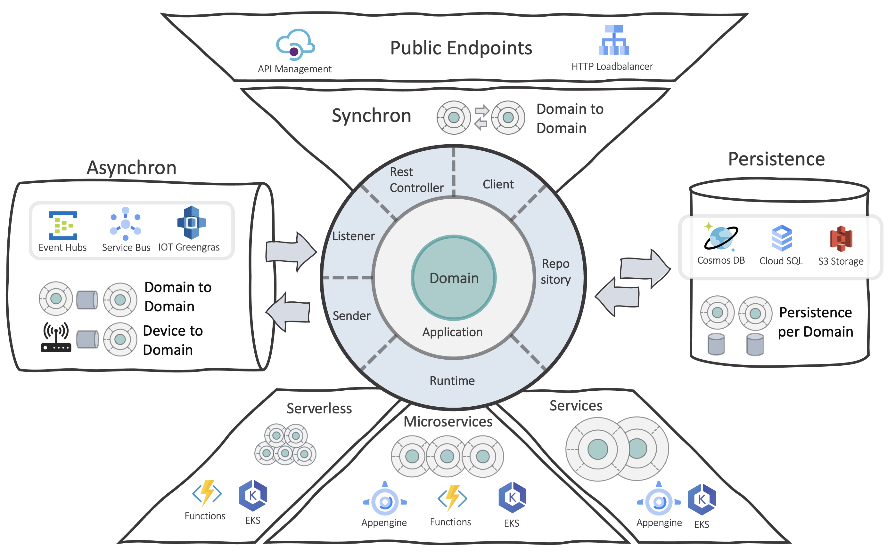

# We love cloud development!

In the last few decades, we at MaibornWolff have developed a whole range of good practices for sustainable architecture from a large number of customer software development projects. The reservations of large companies regarding the use of cloud services have greatly decreased. As a result of this development, not only the number of consumers growing rapidly, but also the number of services offered.

Many of our good practices can be applied directly or indirectly to cloud native applications. The basis has always been a component-oriented design that can be used in classic software architectures as well as in large, decentralized architectures. We build components out of a closed technical domain and combine them with corresponding cloud resources to form a complete application. This works for coarse application services, microservices but also for fine-grained serverless architectures.

We are happy to share our experiences with everyone in this cloud native architecture guide. Over time, we will publish individual chapters for infrastructure-, code-, serverless. and delivery architecure!

{:width="25%"}

[Part 1: Infrastructure Architecture](architectures/infrastructure/cnag-infra-guide.md)